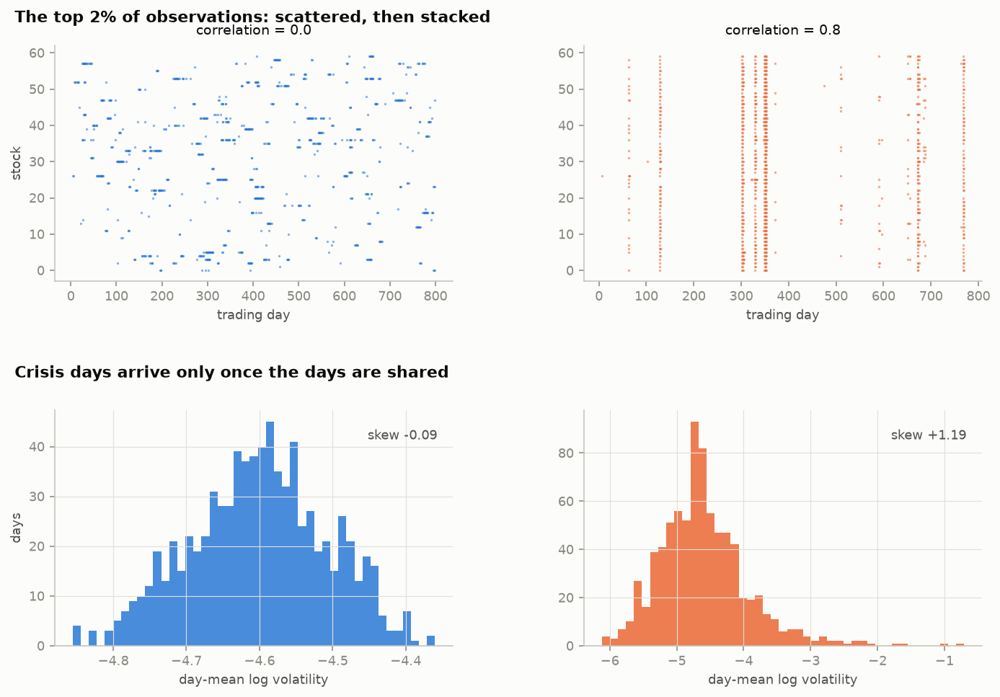
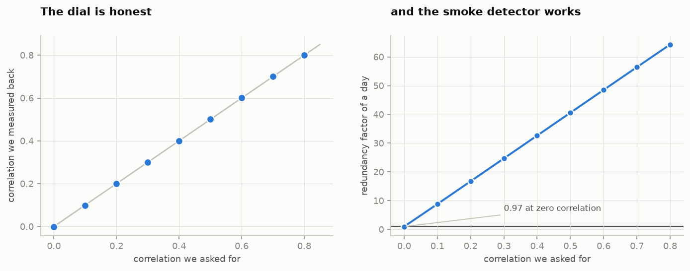
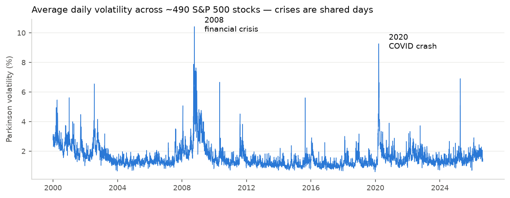
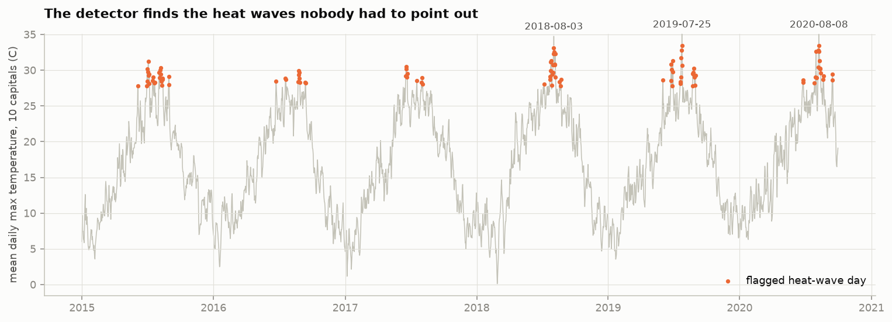
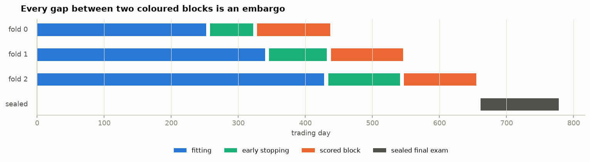
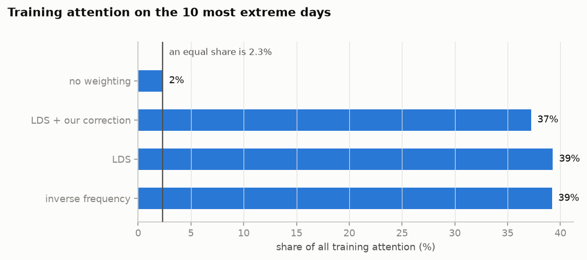
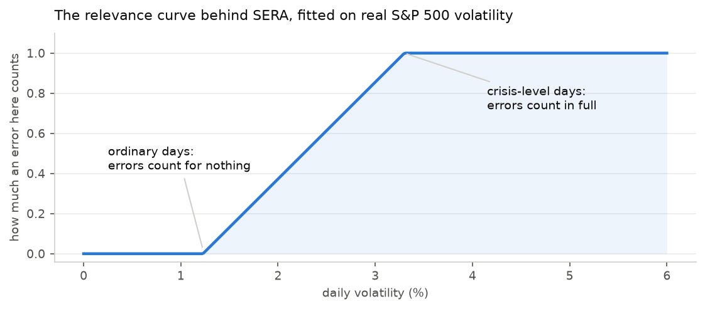
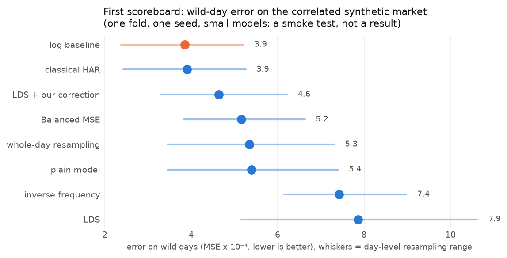

# Research Journal

## What this project is about

Machine-learning models are bad at predicting rare, extreme outcomes market
crashes, record heat waves because they see so few of them. The standard fix
("Deep Imbalanced Regression") is to make rare examples count extra during
training. Our suspicion: when one crisis produces hundreds of near-identical
examples (every S&P stock on the day Lehman fell is the *same story* told 500
times), counting them all extra makes the model **memorize the few crises it
has seen** instead of learning what extremes look like in general. We're testing
whether that's true, and whether counting each *event* once rather than each
row fixes it.

---

## 2026-09-01 Phase 1: the three datasets

### 1. A fake market where we control how much stocks move together

We built a simulator of daily volatility (how wildly a stock's price swings)
for ~100 fake stocks, with one dial: **how much all stocks move together**
(called ρ, "rho", from 0 to 0.8). Because we control the dial, any effect we
find later can be traced directly to it. The picture below shows the whole
thesis in one glance: at ρ = 0 the extreme observations are scattered
everywhere; at ρ = 0.8 they stack into vertical stripes: a few terrible *days*,
each hitting every stock at once.

### 2. Checking the dial actually works

We dial in a correlation, generate data, and measure the correlation back out.
The dots land on the diagonal the dial does what it claims. At ρ = 0 the
"redundancy alarm" (design effect, more below) correctly reads exactly 1.00.
That's our built-in smoke detector: if it ever reads anything else at zero
correlation, the measuring tools are broken, not the data. This check now runs
automatically in the test suite.

### 3. The real stock market, 2000–2026

From a free daily-price archive we computed daily volatility for 
**492 S&P 500 stocks over 6,705 trading days 2.7 million observations**. 
The spikes below are the 2008 financial crisis and the 2020 COVID crash: 
crises are *shared* days, exactly the correlated-extremes situation we 
want to study. Measured togetherness: **0.435** The punchline number: an
average day contains ~405 stock-observations, but because they move together 
so much, they carry only about **2 days' worth of independent information**
(redundancy factor ≈ 186). A reweighting method that counts all 405 is
massively over-counting one story.

### 4. Electricity demand during heat waves

Second real dataset, different domain: daily peak electricity demand for **10
European countries over ~5.7 years** (plus each capital's temperature). Here the
"crisis" is a heat wave hitting the whole continent at once. Our automatic
heat-wave detector (no hand-tuning, just "hotter than 95% of days") finds
exactly the right events: the record July 2019 wave, August 2018, August 2020.
Zones move together even more than stocks: togetherness **0.745**, so a 10-zone
day carries only ~1.3 zones' worth of independent information.

One lesson learned here: measured naively, the togetherness came out *negative*
(−0.09), because Germany's demand is ten times Portugal's and that gap drowns
out the co-movement. Each zone has to be measured against its own normal first.
That trap is now handled in our measuring code.

### 5. What counts as "one event", and the simple opponents

We froze the definitions before running any experiments, so we can't
accidentally tune them later: an **event = one calendar day** (all stocks/zones
on that day belong to it), with multi-day episodes (like a week-long heat wave)
as a variant. We also wired up the simple opponents every fancy method must
beat: "tomorrow looks like the recent past" (HAR), "same day last week"
(seasonal naive), and a standard model fed the temperature (gradient boosting).

## The three datasets at a glance

| dataset | rows | units | days | togetherness (ICC) | redundancy factor | one event is |
|---|---|---|---|---|---|---|
| synthetic market | any | any | any | dialed: 0 → 0.8 | 1 → ~64 | a trading day |
| S&P 500 volatility | 2,716,706 | 492 stocks | 6,705 | 0.435 | ≈ 186 | a trading day |
| EU electricity | 20,979 | 10 zones | 2,100 | 0.745 | ≈ 7.7 | a day / heat-wave episode |

*Togetherness (ICC): 0 = units move independently, 1 = in lockstep. Redundancy
factor (design effect): how over-counted a day is when every row is treated as
independent: 405 stock-rows ÷ 186 ≈ 2 truly independent observations.*

## 2026-09-01 Phase 2: the paranoia suite

To avoid data leakage and ensure the integrity of out testing we do the following:

- **A sealed final exam.** The last stretch of time is locked away. The code
  refuses to hand it over unless you explicitly confirm, and tests prove no
  training or validation slice ever touches it.
- **Quarantine gaps.** Between every study period and its test period we skip
  a few days, so the last study day's "tomorrow" cannot land in the test.
- **Nothing is computed from the future.** Every number the pipeline learns
  from data (histogram bins, scalers, the togetherness measure) is fitted on
  the study slice only. The proof is blunt: we multiply all test data by 100,
  or delete it entirely, and verify nothing on the study side moves by a
  single bit. 24 variations of this run automatically.
- **We test the tests.** A smoke detector you never test is decoration. We
  plant a deliberately cheating feature (the answer itself) and confirm the
  leak detector goes off. It does. We also corrupt the training slice and
  confirm every fitted number *does* change, so no check can pass vacuously.

## 2026-09-01 Phase 3: the competitors

Now the contestants. Every method uses the exact same small neural network,
same optimizer, same training budget. The only thing that differs is what data 
each one sees and how much each example counts. If a method wins, it wins on 
its idea, not on scale or architecture. 

- **The plain model.** Sees everything, counts everything once. Tends to
  ignore extremes, which is the problem we started with.
- **The honest baseline.** The same model with the target on a log scale.
  Costs nothing, and every fancy method has to beat it.
- **Portion control (weighting).** Rare examples count extra: bluntly
  (inverse frequency) or smoothed (LDS, the method our paper examines). Our
  correction belongs to this family and is explained just below.
- **Menu control (sampling).** Change the menu instead of the portions: drop
  common days, repeat rare days, cook up synthetic rare-ish days (SMOTER), or
  repeat whole days at a time (our cluster-aware version).
- **The modern toolbox.** Three recent methods from the literature (FDS,
  RankSim, Balanced MSE), so the comparison covers today's field and not just
  the 2021 original.

### Our correction, in plain words

Picture a crash day with 60 stocks as 60 newspapers all running the same
front-page story. LDS hands a big weight to every rare example it sees, so the
model reads that one story 60 times and counts it as 60 fresh lessons. That is
the over-counting we want to fix, without losing the extra attention that rare
days deserve. The correction splits each day's attention into two parts:

1. **The individual stories.** Each stock keeps its own LDS weight, but shrunk
   by the day's redundancy factor. With 60 stocks moving together at
   correlation 0.8, the redundancy factor is about 48, meaning the 60 front
   pages hold only about one story's worth of independent news. So only a
   small sliver of the individual weights survives.
2. **The shared story.** The rest of the day's attention is given to the day
   as a whole: one single weight, sized by how unusual that day was compared
   to other days, then shared out among its 60 stocks.

The net effect: a crash day still gets extra attention for being rare, but it
gets it once, as one important story, not 60 times over. And the correction
knows when to stand down. If stocks do not move together at all, the
redundancy factor is 1, part 1 keeps everything, part 2 gets nothing, and we
are back to plain LDS exactly. That is the same null gate our diagnostics
promised: at zero correlation, no correction.

On a highly correlated synthetic market, LDS spends 37% of its total training
attention on 10 days out of 400. Our correction brings that to 31% while still
giving rare days far more than their equal share of 3%. Whether the smaller
dose of obsession buys better predictions on unseen events is exactly what the
experiments will measure.

One design discovery worth recording: our first idea, dividing each day's
weight by its redundancy factor, does nothing when every day has the same
number of stocks, because dividing everything by the same number changes
nothing in relative terms. The two-part weight described above is the fix.
Catching this before any experiment ran is what the test suite is for.

## 2026-09-01 Phase 4: the referee

Now we define the metrics to establish a baseline for what we would expect to 
see if our hypothesis is correct.

- **Overall accuracy.** Standard error measures across all days, so nobody
  wins the extremes by ruining the everyday forecasts.
- **Accuracy on the wild days only.** The same errors, restricted to days
  above the top 5% and 10% of what was seen in training.
- **SERA.** Instead of one sharp cutoff between ordinary and wild, every error 
  is weighted by how much we care about that level of the target, using the curve 
  below.
- **The memorization gap.** wild-day error on days the model has never seen, 
  minus wild-day error on the days it trained on. A model that learned the 
  subject scores similarly on both. A model that memorized its few crises aces 
  the seen ones and flunks the unseen ones. This gap is the paper's central 
  diagnostic.
- **Per-event scores.** Errors are averaged within each day first, then
  across days. Otherwise one 500-stock crisis day would sway the average 500
  times over, the very over-counting this paper accuses others of.

Error bars come from resampling whole days, never single rows. Rows from the
same day rise and fall together, so row resampling would claim far more
certainty than the data holds; our tests confirm the honest day-level error
bars are more than twice as wide. When two methods are compared, both are
scored on the same resampled days and we report the range of the difference.

### A first scoreboard

To check the whole machine end to end, we ran one small contest on the highly
correlated synthetic market (correlation 0.8): eight methods, same data, same
splits, same scoring. Fair warning: one fold, one seed, small models. This is
a smoke test of the pipeline, not a result. With that said, the errors
relative to the log baseline (1.00 = its score, lower is better):

| method | overall error | wild-day error |
|---|---|---|
| log baseline | 1.00 | 1.00 |
| classical HAR | 1.01 | 1.01 |
| LDS + our correction | 1.46 | 1.20 |
| Balanced MSE | 1.86 | 1.34 |
| whole-day resampling | 1.44 | 1.39 |
| plain model | 1.48 | 1.40 |
| inverse frequency | 3.39 | 1.93 |
| LDS | 2.69 | 2.04 |

Three things stand out, all pointing the way the paper suspects:

1. **The reweighting methods came last, on their home turf.** LDS and inverse
   frequency were roughly twice as bad as doing nothing at all, on the wild
   days they exist to help. On correlated data, extra attention to rare rows
   bought obsession, not skill.
2. **Our correction repaired most of the damage.** Same model, same LDS idea,
   but counting each story once: wild-day error fell from 2.04 to 1.20.
3. **The humble baselines set a high bar.** Taking logs, or the 2009-vintage
   HAR formula, beat every clever method in the race. Any paper claiming
   progress on rare events should have to show this comparison.

The whiskers in the chart are the honest day-level uncertainty ranges, and
they are wide: single-fold differences of this size could shrink in the real
experiments. That is what the full runs, with many folds, seeds, and all
three datasets, are for.
