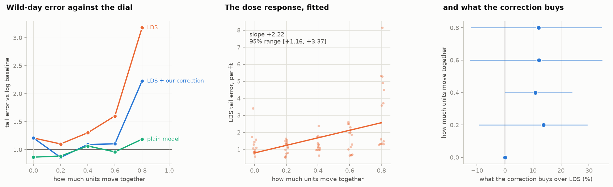
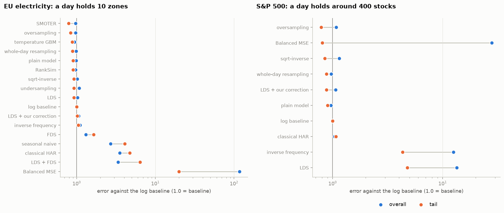
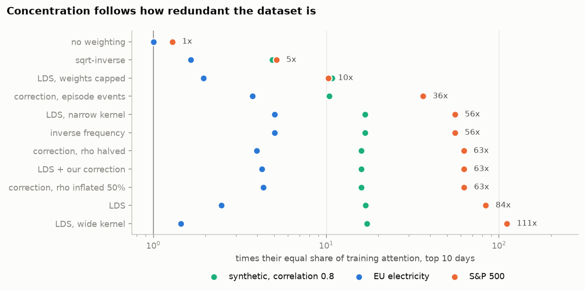
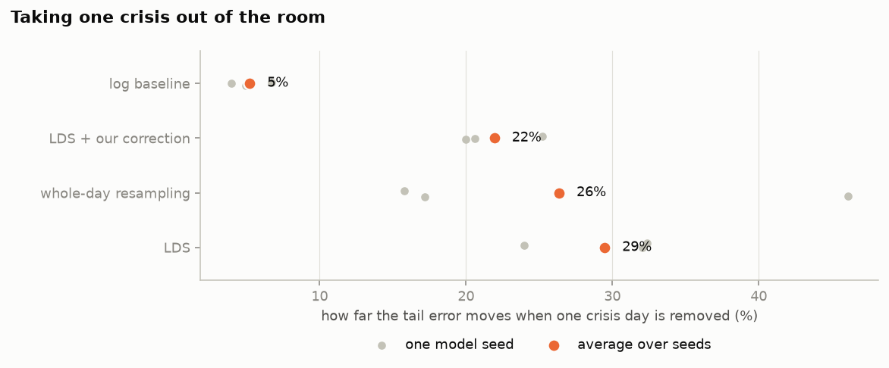
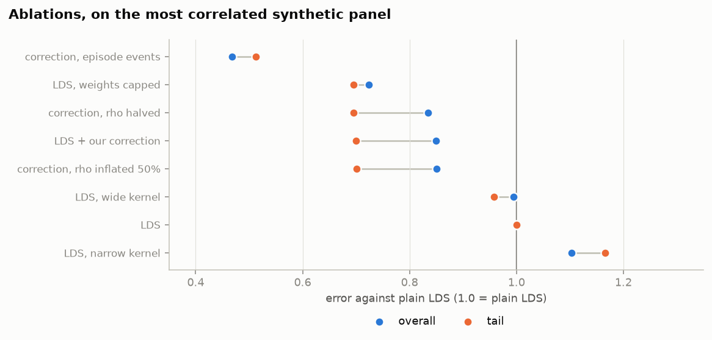

# Research Journal

## What this project is about

Machine-learning models are bad at predicting rare, extreme outcomes such as
market crashes and record heat waves, because they see so few of them. The standard fix
("Deep Imbalanced Regression") is to make rare examples count extra during
training. Our suspicion: when one crisis produces hundreds of near-identical
examples (every S&P stock on the day Lehman fell is the *same story* told 500
times), counting them all extra makes the model **memorize the few crises it
has seen** instead of learning what extremes look like in general. We're testing
whether that's true, and whether counting each *event* once rather than each
row fixes it.

---

## 2026-09-01 Phase 1: the three datasets

### 1. A fake market where we control how much stocks move together

We built a simulator of daily volatility (how wildly a stock's price swings)
for 60 fake stocks, with the ability to control their InterClass Correlation (ICC):
**how much all stocks move together** (called ρ, "rho", from 0 to 0.8). Because we
control the ICC, any effect we find later can be traced directly to it.

The top half (scatterplots) show us that when ρ = 0 the extreme observations are
scattered everywhere; at ρ = 0.8 they stack into vertical stripes, a few terrible
*days* each hitting every stock at once. The bottom half shows that at ρ = 0.8 the
distribution of day averages leans hard to the right, skew +1.19, the same lopsided
shape the real S&P 500 has at +1.07. At ρ = 0 there is no shared factor to be
extreme, so the day averages are a symmetric bell and no day is a crisis. That
contrast is the generator working as intended.

### 2. Checking the dial actually works

We generated synthetic data and measured it to confirm that it displays the
intended properties. The dots land on the diagonal, so the ICC setting does
what it claims. At ρ = 0 the correctly reads 0.99 (no ICC so no redundancy).

| rho | measured | redundancy factor | row skew | day-mean skew | day-mean kurtosis |
|---|---|---|---|---|---|
| 0.0 | -0.00 | 0.99 | -0.04 | +0.13 | +0.94 |
| 0.2 | 0.20 | 13.1 | +0.08 | +0.57 | +0.67 |
| 0.4 | 0.42 | 25.9 | +0.36 | +1.18 | +4.40 |
| 0.6 | 0.61 | 36.8 | +0.35 | +0.73 | +1.09 |
| 0.8 | 0.81 | 48.6 | +0.87 | +1.19 | +3.53 |

### 3. The real stock market, 2000–2026

From a free daily-price archive we computed daily volatility for
**492 S&P 500 stocks over 6,705 trading days, 2.7 million observations**.
The spikes below are the 2008 financial crisis and the 2020 COVID crash:
crises are *shared* days, exactly the correlated-extremes situation we
want to study. Measured togetherness (ICC): **0.435**.

The 492 above is the number of distinct tickers in the panel, not the number
trading on any given day. Stocks enter as they list, so the first day of 2000
carries 219 of them and the last day of the sample carries all 492, with a
median day at 435 and an average of 405. Those per-day counts, not the 492, are
what the redundancy arithmetic works on.

So a typical day holds around 400 stock-observations, but because they move
together so much they carry only about **2 stocks' worth of independent
information** (redundancy factor ≈ 186). A reweighting method that counts all
400 is massively over-counting one story.

We filtered for outliers: sessions whose high is five times their low or
more are dropped as misplaced decimals. That removes exactly eight rows, all
near ten times, against a largest genuine session range of just over four times
on AIG the day after Lehman. Rows we deliberatly kept, so the cut is visible:
Verizon at 3.8x, Lowe's at 3.3x, Tesla at 3.9x.

### 4. Electricity demand during heat waves

Second real dataset, different domain: daily peak electricity demand for **10
European countries over ~5.7 years** (plus each capital's temperature). Here the
"crisis" is a heat wave hitting the whole continent at once. Our automatic
heat-wave detector (hotter than 95% of days) finds exactly the right events: the
record July 2019 wave, August 2018, August 2020. Zones move together even more
than stocks: togetherness **0.746**, so a 10-zone day carries only ~1.3 zones'
worth of independent information.

Measured naively, the togetherness came out *negative* (−0.09), because Germany's
demand is ten times Portugal's and that gap drowns out the co-movement. Each zone
has to be measured against its own normal first.

We filtered for outliers: daily peaks above twice a zone's own median are
dropped. That removes one row, France at 158 GW on 2020-07-07 against a French
median of 56 and a real record near 102, and no other day in any of the ten
zones reaches 1.7 times its median.

### 5. What counts as "one event", and the simple opponents

We froze the definitions before running any experiments: **event = one calendar day**
(all stocks/zones on that day belong to it), with multi-day episodes (like a week-long heat wave)
as a variant. We also wired up the opponents every method should
beat: "tomorrow looks like the recent past" (HAR), "same day last week"
(seasonal naive), and a standard model fed the temperature (gradient boosting).

### The three datasets at a glance

| dataset | rows | units | days | togetherness (ICC) | redundancy factor | day-mean skew | one event is |
|---|---|---|---|---|---|---|---|
| synthetic market | 48,000 | 60 stocks | 800 | dialed: 0 → 0.8 | 1 → 49 | +0.13 → +1.19 | a trading day |
| S&P 500 volatility | 2,716,698 | 492 stocks | 6,705 | 0.435 | ≈ 186 | +1.07 | a trading day |
| EU electricity | 20,978 | 10 zones | 2,100 | 0.746 | ≈ 7.7 | −0.30 | a day / heat-wave episode |

*Togetherness (ICC): 0 = units move independently, 1 = in lockstep. Redundancy
factor (design effect): how over-counted a day is when every row is treated as
independent. Kish's formula, 1 + (m − 1) × ICC, on the S&P's size-weighted mean
day of 427 stocks gives 1 + 426 × 0.435 ≈ 186, so a day's ~400 rows are worth
about 427 ÷ 186 ≈ 2 independent observations. That ceiling is 1 / ICC = 2.3 no
matter how many stocks trade, which is the whole problem in one number. Day-mean
skew: how lopsided the distribution of daily averages is, so how much a crisis
day stands out from an ordinary one.*

Note the last column. Volatility is sharply right-skewed and the synthetic
market is built to match it, but electricity demand is not: its day averages
lean slightly *left*. A cold snap raises demand by half, where a crash multiplies
volatility several times over.

## 2026-09-01 Phase 2: the paranoia suite

To avoid data leakage and ensure the integrity of our testing we do the following:

- **A sealed final exam.** The last stretch of time is locked away and stays
  locked for now, reserved for a single final evaluation.
- **Quarantine gaps.** Between every study period and its test period we skip
  a few days, so the last study day's "tomorrow" cannot land in the test.
- **Nothing is computed from the future.** Every number the pipeline learns
  from data (histogram bins, scalers, the togetherness measure) is fitted on
  the study slice only.

## 2026-09-01 Phase 3: the competitors

Every method uses the exact same small neural network,
same optimizer, same training budget. The only thing that differs is what data
each one sees and how much each example counts. If a method wins, it wins on
its idea, not on scale or architecture.

- **The plain model.** Sees everything, counts everything once. Tends to
  ignore extremes.
- **The honest baseline.** The same model with the target on a log scale.
- **Portion control (weighting).** Rare examples count extra:
  inverse frequency or smoothed (LDS).
- **Menu control (sampling).** Drop common days, repeat rare days, generate synthetic rare days (SMOTER), or
  repeat whole days at a time (cluster-aware version).
- **The modern toolbox.** Recent methods from the literature (FDS,
  RankSim, Balanced MSE).

### Our correction

Picture a crash day with 60 stocks as 60 newspapers all running the same
front-page story. LDS hands a big weight to every rare example it sees, so the
model reads that one story 60 times and counts it as 60 fresh lessons. That is
the over-counting we want to fix, without losing the extra attention that rare
days deserve. The correction splits each day's attention into two parts:

1. **The individual stories.** Each stock keeps its own LDS weight, but shrunk
   by the day's redundancy factor. With 60 stocks moving together at
   correlation 0.8, the redundancy factor is about 48, meaning the 60 front
   pages hold only about one story's worth of independent news. So only a
   small sliver of the individual weights survives.
2. **The shared story.** The rest of the day's attention is given to the day
   as a whole: one single weight, sized by how unusual that day was compared
   to other days, then shared out among its 60 stocks.

The net effect: a crash day still gets extra attention for being rare, but it
gets it once, as one important story, not 60 times over. If stocks do not move together at all, the
redundancy factor is 1, part 1 keeps everything, part 2 gets nothing, and we
are back to plain LDS exactly. So at zero correlation, no correction.

On a highly correlated synthetic market, LDS spends 39% of its total training
attention on 10 days out of 429, where an equal share would be 2.3%. Our
correction brings that to 37%. That is a smaller dent than we expected, and we
say so: on a balanced panel where every day has the same 60 stocks, the
event-level channel can only redistribute attention *between* days, not shrink
the total that lands on the worst ones. Whether the change buys better
predictions on unseen events is exactly what the experiments will measure.

## 2026-09-01 Phase 4: Hypothesis Metrics

Now we define the metrics to establish a baseline for what we would expect to
see if our hypothesis is correct.

- **Overall error.** Standard error measures across every row, so nobody wins
  the tail by ruining the ordinary forecasts.
- **Tail error.** The same errors, restricted to rows above the top 5% of what
  was seen in training.
- **The memorization gap.** Tail error on rows the model has never seen against
  tail error on the rows it trained on.

Error bars come from resampling whole days, never single rows. Rows from the
same day rise and fall together, so row resampling would claim far more
certainty than the data holds; our tests confirm the honest day-level error
bars are more than twice as wide. When two methods are compared, both are
scored on the same resampled days and we report the range of the difference.

## 2026-09-02 Phase 5: the experiments

Five grids and
1,650 model fits, every method on the same data with the same budget. The
sweep is 5 correlations x 15 methods x 5 seeds x 3 folds on its own.

**How to read every number in this phase.** Errors are mean squared error.
*Tail error* counts only rows whose true next-day value lands in the top 5% of
the training rows; *overall error* counts every row. Each method is then
divided by the log baseline refitted on the same window and seed, and those
ratios are averaged. So 1.00 always means "the same as taking logs", and lower
is better.

### The main event: turning the correlation dial

Our first claim was: as units move together more, reweighting should hurt
more. Fitting a line through the LDS results
gives a slope of **+2.22, with a 95% range of +1.16 to +3.37**. We predicted a
positive slope, the measured one is positive, and the range does not include
zero.

*Tail error against the log baseline, averaged over 5 seeds x 3 windows at each
correlation. All fifteen windows held enough tail rows to score, the thinnest
46, so none was dropped.*

| method | rho = 0.0 | rho = 0.2 | rho = 0.4 | rho = 0.6 | rho = 0.8 |
|---|---|---|---|---|---|
| log baseline | 1.00 | 1.00 | 1.00 | 1.00 | 1.00 |
| classical HAR | 0.96 | 0.99 | 0.98 | 0.95 | 0.96 |
| whole-day resampling | 0.87 | 0.88 | 1.03 | 0.91 | 1.11 |
| oversampling | 0.85 | 0.86 | 1.05 | 0.89 | 1.12 |
| plain model | 0.87 | 0.89 | 1.07 | 0.96 | 1.19 |
| LDS + our correction | 1.21 | 0.86 | 1.09 | 1.11 | **2.23** |
| LDS | 1.21 | 1.10 | 1.30 | 1.60 | **3.18** |
| inverse frequency | 1.16 | 1.35 | 1.16 | 1.55 | **3.47** |

At zero correlation the reweighting methods
are about 20% worse than doing nothing; by the time every stock moves together
they are three times worse than taking logs, on exactly the tail they were
built to help. Nothing else moves like that: the sampling methods and the plain
model drift from 0.85 to about 1.15, and HAR does not move at all. The claim
belongs to reweighting, not to the panel getting harder, which is why the other
rows are in the table.

### The memorization signature

*Tail error against the log baseline, scored twice: once on the training
rows the model fitted on, once on the validation rows it never saw. The top 5%
cutoff comes from the training rows and is applied unchanged to both lines, so
the only difference between them is whether the model has seen those rows.*

| LDS | rho = 0.0 | rho = 0.2 | rho = 0.4 | rho = 0.6 | rho = 0.8 |
|---|---|---|---|---|---|
| on the extremes it **trained on** | 1.23 | 1.21 | 1.31 | 1.27 | **1.01** |
| on the extremes it **never saw** | 1.21 | 1.10 | 1.30 | 1.60 | **3.18** |
| unseen divided by seen | 0.98 | 0.91 | 1.00 | 1.26 | **3.15** |

At zero correlation LDS does equally badly on both, ratio 0.98. At the top of
the dial it has pulled level with the baseline on the crises in its own training
set while being three times worse on crises it has not met. That is what
memorizing a handful of events looks like from outside, and it is exactly the
mechanism our research proposed.

The last row already divides the baseline out, since both lines above it are
measured against it, so "extremes are simply harder out of sample" is not what
is being shown. Every method's ratio for comparison:

*Unseen error divided by seen error, both relative to the log baseline. 1.00 =
does equally well on extremes it met and extremes it did not; higher = worse on
the ones it never saw.*

| method | rho = 0.0 | rho = 0.4 | rho = 0.8 |
|---|---|---|---|
| inverse frequency | 1.05 | 0.93 | **3.33** |
| LDS | 0.98 | 1.00 | **3.15** |
| LDS + our correction | 0.98 | 1.17 | **2.57** |
| oversampling | 1.04 | 1.19 | 1.56 |
| plain model | 1.02 | 1.14 | 1.54 |
| whole-day resampling | 1.01 | 1.18 | 1.50 |
| log baseline | 1.00 | 1.00 | 1.00 |

The reweighting family separates from everything else, and only at high
correlation. The sampling methods and the plain model widen too, to about 1.5,
because clustered extremes really are harder to generalize from, and that part
is not anybody's fault. Reweighting doubles it.

### What the correction does buy

The null gate holds exactly. At rho = 0 the correction and plain LDS score
**identically** in all 15 fits, a gain of +0.0% with a range of +0.0% to +0.0%.
That is the Phase 3 design working as written: no correlation, no correction.

Once units do move together it beats LDS in **65% of the 60** fits, by **12.2%
on average, 95% range +2.0% to +22.0%**. Both methods are scored on the
same fits, so the gain is computed fit by fit and the range comes from
resampling those 60 paired numbers. It also halves the dose: LDS climbs at
+2.22 per unit of correlation, the correction at **+1.14, range +0.52 to +1.73**.

Halves, but does not remove. At rho = 0.8 the correction still lands at 2.23
against the baseline's 1.00, with a memorization ratio of 2.57.

### The real datasets

The two datasets part company completely, and the split follows redundancy
exactly as the mechanism says it should.

*Both columns are errors against the log baseline, averaged over 3 windows x 5
seeds on electricity and 3 windows x 3 seeds on the S&P.*

**Electricity, where a day holds 10 zones.** Our correction does not help.

| method | tail error | overall error |
|---|---|---|
| SMOTER | 0.79 | 0.97 |
| oversampling | 0.84 | 0.97 |
| temperature GBM | 0.88 | 0.94 |
| whole-day resampling | 0.89 | 0.98 |
| plain model | 0.90 | 0.99 |
| RankSim | 0.90 | 0.97 |
| LDS | 0.92 | 1.02 |
| log baseline | 1.00 | 1.00 |
| **LDS + our correction** | **1.02** | **1.06** |
| inverse frequency | 1.05 | 1.10 |
| FDS | 1.64 | 1.31 |
| seasonal naive | 4.07 | 2.69 |
| classical HAR | 4.73 | 3.53 |
| LDS + FDS | 6.37 | 3.36 |
| Balanced MSE | 19.95 | 116.87 |

The correction is 11% *worse* than the plain LDS it is meant to repair, and no
better than taking logs. That is what the mechanism predicts: with ten zones a
day there is almost nothing to correct, and plain LDS is *fine* here at 0.92,
which is the other half of the same point. The reshuffling methods win instead.
HAR and seasonal-naive do badly, as they should, since neither was built for
electricity demand.

**The stock market, where a day holds around 400 stocks.** A different world.

| method | tail error | overall error |
|---|---|---|
| oversampling | 0.79 | 1.08 |
| Balanced MSE | 0.81 | 27.99 |
| sqrt-inverse | 0.85 | 1.15 |
| whole-day resampling | 0.88 | 0.97 |
| **LDS + our correction** | **0.88** | **1.07** |
| plain model | 0.90 | 0.97 |
| log baseline | 1.00 | 1.00 |
| classical HAR | 1.07 | 1.04 |
| inverse frequency | 4.33 | 12.51 |
| **LDS** | **4.78** | **13.44** |

LDS is nearly five times worse than taking logs on the tail it was built to
help, and thirteen times worse overall. The correction takes the same
weighting idea and lands at 0.88, better than the log baseline. That is a
five-fold repair from one change: counting each story once.

### The same test on the real data, where it disagrees

*The same seen-versus-unseen measure, one row per dataset, each at its own
correlation.*

| dataset | LDS on extremes it trained on | on extremes it never saw | ratio |
|---|---|---|---|
| synthetic, correlation 0.8 | 1.01 | 3.18 | **3.15** |
| EU electricity | 0.84 | 0.92 | 1.09 |
| S&P 500 | 6.38 | 4.78 | **0.75** |

On the S&P the ratio is *below* one: LDS is worse on the extremes in its own
training set than on the ones it never saw, in every fit. It never aces the seen
ones, so there is nothing there that deserves the word memorizing.

What happens on the S&P instead is instability.

*Tail error against the log baseline, per individual fit instead of averaged
over them. Nine fits, 3 windows x 3 seeds. Spread is worst divided by best.*

| method | average | best fit | worst fit | spread |
|---|---|---|---|---|
| LDS | 4.78 | 1.00 | 13.71 | **14x** |
| inverse frequency | 4.33 | 1.00 | 11.66 | 12x |
| LDS + our correction | 0.88 | 0.82 | 0.96 | 1.2x |
| oversampling | 0.79 | 0.75 | 0.83 | 1.1x |
| log baseline | 1.00 | 1.00 | 1.00 | 1.0x |

LDS sometimes matches the baseline and sometimes misses it by a factor of
fourteen. It is not learning a wrong lesson consistently, it is failing to
settle anywhere. The correction removes the instability, not just the average.

So there are two failure modes, not one, and which appears depends on the
dataset: on a controlled panel reweighting memorizes, on the real market it
destabilizes. Both come from the same cause, which the next section measures
directly.

### Follow the training attention

This is the clearest picture in the phase, and it explains the split above.

*Total training weight landing on the ten most heavily weighted days, divided by
what those ten days would get if every day counted the same. 1.0x means no
concentration at all, 84x means those ten days carry 84 times their fair share.
Computed on the training rows before any model is fitted, so no fitting or
seeding is involved.*

| weighting | synthetic rho = 0.8 | EU electricity | S&P 500 |
|---|---|---|---|
| no weighting | 1.0x | 1.0x | 1.3x |
| sqrt-inverse | 4.9x | 1.6x | 5.2x |
| LDS, weights capped | 10.8x | 2.0x | 10.3x |
| correction, episode events | 10.4x | 3.7x | 36.3x |
| inverse frequency | 16.8x | 5.0x | 55.6x |
| LDS + our correction | 16.0x | 4.3x | 62.8x |
| LDS | 16.8x | 2.5x | **83.8x** |

On the stock market LDS gives ten days out of 3,775 about 84 times their fair
share. On electricity the same method reaches 2.5x. The gap follows the
redundancy of the two datasets, 186 against 7.7. That is the argument in one
table, and it explains the negative result on electricity too: there is no
over-counting to fix there, so a fix can only get in the way.

Our correction barely moves this measure, and on electricity it raises it:
16.0x against LDS's 16.8x on the synthetic panel, 62.8x against 83.8x on the
S&P, but 4.3x against 2.5x on electricity. Plain weight capping flattens it far
more, 10.3x against 62.8x on the S&P. What the correction actually does is move
attention *between* days, from days that are big because many rows repeat one
story to days that are big because the day itself was unusual, and a top-ten
share cannot see that distinction.

### Taking one crisis out of the room

The other way to look for memorizing is to remove a memory.

*Each of the eight biggest training days was dropped in turn and the model
refitted, on the most correlated synthetic panel. The swing is how far tail
error moved from the fit with every day present, as a percentage of it. Averaged over
3 seeds; "worst" is the single most damaging removal.*

| method | average swing | worst swing |
|---|---|---|
| LDS | 29% | 86% |
| whole-day resampling | 26% | 74% |
| LDS + our correction | 22% | 50% |
| log baseline | 5% | 8% |

The log baseline barely notices, 5%, which is the control this test needed:
removing one day out of 429 should do almost nothing to a method that estimates
no densities and assigns no weights. Everything that touches the tail moves five
times as much, LDS most and the correction least. But whole-day resampling lands
between them, so the ordering is not clean, and we report this as suggestive
rather than settled.

### Ablations

An ablation changes exactly one ingredient of a method, keeping everything else
identical, so that any change in score can be blamed on that one ingredient.
Here we vary four things about LDS and about our correction: how wide the
smoothing kernel is, whether the weights are capped, whether rho is estimated
correctly, and what counts as an event.

*Errors against **plain LDS** rather than the log baseline, so 1.00 is plain LDS
and lower means the variant beats it. Most correlated synthetic panel, 3 windows
x 3 seeds.*

| variant | tail error | overall error |
|---|---|---|
| correction, episode events | **0.51** | **0.47** |
| LDS, weights capped | 0.70 | 0.72 |
| correction, rho halved | 0.70 | 0.83 |
| LDS + our correction | 0.70 | 0.85 |
| correction, rho inflated 50% | 0.70 | 0.85 |
| LDS, wide kernel | 0.96 | 1.00 |
| LDS | 1.00 | 1.00 |
| LDS, narrow kernel | 1.17 | 1.10 |

Four questions, and the third one is a problem for us.

1. **Is plain clipping enough?** On the tail, yes: capping the weights at ten
   times the mean scores 0.70, exactly what the correction scores, and it beats
   the correction on overall error, 0.72 against 0.85. A one-line clip does the
   whole job here. The case for the correction over a clip is not its score on
   this panel, it is that it has no threshold to pick by hand and that it
   reduces to plain LDS exactly when there is nothing to correct.
2. **Does the correction need rho to be right?** No. Halving the estimate or
   inflating it by half gives 0.70 either way, identical on the tail.
3. **Does it need the events to be right?** Yes, and the right event is not
   the one we froze. Merging extreme stretches into multi-day episodes is the
   best variant in the table by a wide margin, 0.51 against 0.70. That makes
   sense: each crisis is an arrival that decays over the following days, so a
   crisis really is a multi-day episode, and calling each of its days a separate
   event under-counts the redundancy. We are not moving the frozen definition
   after seeing this. It is recorded as what it is: the event definition is a
   live research question, not a detail.
4. **Kernel width** barely matters, though turning the smoothing off is worse,
   1.17 against 1.00.

### Other things that fell out

**Balanced MSE is broken, not merely bad.** It scores well on the tail only
because it guesses high everywhere, and pays 28 times the overall error on the
stock market and 117 times on electricity. We report both numbers side by
side everywhere so it cannot hide behind the good one.

**FDS fails.** LDS's companion method from the same 2021 paper scores 1.64 on
electricity, 6.37 in combination. It breaks on the shortest training window for
all five seeds, so it is not one unlucky run.

### Where this leaves the three claims

- **Dose response: supported.** Wild-day error for reweighting climbs steeply
  with correlation, and nothing outside the reweighting family moves.
- **Memorizing: supported on the synthetic panel, contradicted on the S&P.** The
  designed diagnostic fires and scales with the dose on the sweep. On the S&P it
  points the other way and the failure mode is instability instead. One
  mechanism does not cover both datasets.
- **The correction: a real improvement, not a fix.** It reduces exactly to LDS
  at rho = 0 as designed, beats LDS wherever units move together, halves the
  dose slope, and repairs the S&P collapse. It does not make reweighting safe.

### Limitations

- **The correction is not the best thing in the table.** At rho = 0.8 it still
  scores 2.23 against the log baseline's 1.00. Plain weight capping matches it
  on the tail and beats it on overall error, and merging days into multi-day
  episodes beats both. The strongest recommendation this evidence supports is
  the least interesting one: take logs and reweight nothing.
- **Concentration does not explain what the correction does.** It barely moves
  the top-ten-day share and on electricity raises it, so the mechanism story is
  incomplete even where the scores are good.
- **The frozen event definition is wrong for this data**, and the evidence for
  the right one is a single ablation.
- **Two real datasets is a thin base** for a claim about redundancy, and they
  disagree about which failure mode appears, so we cannot predict in advance
  which one a new dataset will show.
- **The sealed holdout has not been opened.** Every number here is from
  walk-forward validation windows.

What this project needs next is more real panels spanning a range of redundancy
factors, and an event definition chosen by evidence rather than frozen by fiat.
